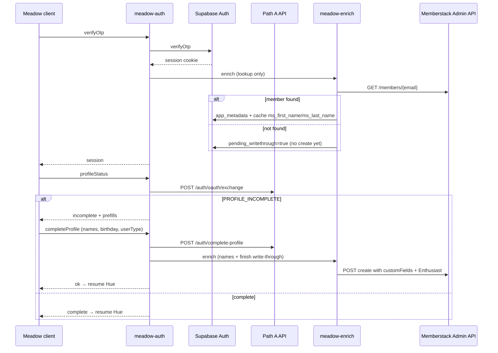

# Meadow Backend Ask — Identity (Supabase OTP + Memberstack enrichment)

**Status:** APPROVED — OTP + enrichment deployed 2026-07-10; **profile-completion delta APPROVED 2026-07-11** ("let's build")  
**Supersedes:** `docs/MEADOW_BACKEND_ASK_P2.md` (Memberstack password bridge — **SUPERSEDED**)  
**Hosting:** Experience at `https://booster.storytailor.com`; assets at `https://assets.storytailor.dev/meadow/` (see `docs/MEADOW_DEPLOYMENT.md`).  
**Authority:** `docs/MEADOW_IDENTITY_PRD.md`  
**Green backend:** OFF-LIMITS until `STORYTAILOR_ALLOW_BACKEND_CHANGE` is set by a human for the implementing commit. Edge function source lives under monorepo `supabase/functions/` — deploy now; leave uncommitted for human override.

---

## Summary

Ship **Supabase Auth email OTP** as the only Meadow sign-in method. Memberstack is **never** in the auth path. After every successful OTP verification, a **non-blocking server job** enriches the Supabase user from Memberstack Admin API (lookup + name cache). **Write-through create is deferred** until Path A profile completion so Memberstack members are never nameless. Hue eligibility requires Path A profile complete — collected **in-modal** via `profileStatus` / `completeProfile` on `meadow-auth` (never redirect to storytailor.com).

The meadow frontend (`experiences/false-earth`) calls either:

- Supabase client `signInWithOtp` / `verifyOtp` directly (when `VITE_SUPABASE_URL` + `VITE_SUPABASE_ANON_KEY` are set), or
- A thin edge proxy at `VITE_MEADOW_AUTH_URL` (preferred for CORS/rate-limit control)

Until deployed, the UI uses local mock via `?meadow-auth-mock=1`.

---

## Architecture



---

## Edge functions (Supabase project `lendybmmnlqelrhkhdyc`)

### `meadow-auth` (OTP proxy + profile gate)

Thin proxy if direct client OTP is undesirable (rate limits, origin lockdown).

| Env var | Default | Behavior |
|---------|---------|----------|
| `MEADOW_AUTH_ENABLED` | `false` | When not `true`, return `503` `{ "message": "Account connection isn't ready yet" }` |

**Actions**

| Action | Request | Response |
|--------|---------|----------|
| `sendOtp` | `{ "action": "sendOtp", "email": "..." }` | `200` `{ "ok": true }` |
| `verifyOtp` | `{ "action": "verifyOtp", "email": "...", "code": "123456" }` | `200` `{ "session": { "userId", "email" } }` |
| `signOut` | `{ "action": "signOut" }` | `200` (clear cookie if cookie mode) |
| `getSession` | `GET ?action=getSession` | `{ "session": ... \| null }` |
| `profileStatus` | `POST { "action": "profileStatus" }` (session cookie) | `{ "complete": true }` **or** `{ "complete": false, "requiredFields": [...], "prefill": { "firstName?", "lastName?" } }` |
| `completeProfile` | `POST { "action": "completeProfile", "firstName", "lastName?", "birthday": "YYYY-MM-DD", "userType" }` | `200` `{ "ok": true }` — proxies Path A `POST /auth/complete-profile`, then triggers deferred write-through |

**`profileStatus`:** probes Path A `POST /auth/oauth/exchange` with the Supabase access token from the session cookie. Prefills prefer Memberstack-cached names (`app_metadata.ms_first_name` / `ms_last_name`), then `public.users` skeleton names when present.

**`completeProfile`:** body maps to Path A:

```json
{
  "accessToken": "<supabase-access-token>",
  "firstName": "...",
  "lastName": "...",
  "userType": "<ADULT_USER_TYPES slug>",
  "ageVerification": { "method": "birthday", "value": "YYYY-MM-DD" }
}
```

Path A receives the **real** `userType` from the Meadow dropdown (17-value adult enum). Memberstack always gets `user-role: Enthusiast` on write-through — roles are independent.

Internally calls Supabase Auth Admin or anon client with service role for OTP dispatch. **Never** expose service role to meadow bundle.

**CORS:** `https://booster.storytailor.com`, `https://localhost:5173`, staging meadow host.

### `meadow-enrich` (post-auth job)

Fires after every successful OTP verification (lookup) and again after `completeProfile` (write-through finish).

| Env var | Default | Behavior |
|---------|---------|----------|
| `ENRICHMENT_ENABLED` | `true` | When `false`, skip Memberstack GET; auth unaffected |
| `WRITETHROUGH_ENABLED` | `true` | When `false`, skip Memberstack create for new users |

**Flow (OTP / lookup)**

1. Validate Supabase JWT from `Authorization: Bearer`.
2. If `ENRICHMENT_ENABLED !== true` → `200` no-op.
3. `GET https://admin.memberstack.com/members/{email}` (Memberstack secret, server only).
4. **Found:** update `auth.users` `app_metadata`:
   - `memberstack_id`
   - `origin: "meadow"`
   - `v2_member: true`
   - `enriched_at` (ISO timestamp)
   - `writethrough: false`
   - `pending_writethrough: false`
   - `ms_first_name` / `ms_last_name` from `customFields["first-name"]` / `customFields["last-name"]` when present
5. **Not found:** do **not** create yet. Set `pending_writethrough: true`, `v2_member: false`, `origin: "meadow"`, `enriched_at`. Failures: log + retry with backoff. **Never** return Memberstack errors to client.

**Flow (post-profile / write-through finish)** — body includes `firstName` (and optional `lastName`) after `completeProfile`:

1. If member already linked → leave existing V2 `user-role` alone (do not overwrite).
2. If `pending_writethrough` and `WRITETHROUGH_ENABLED`:
   - `POST` create Memberstack member with random discarded password
   - `metaData.source: "meadow"`
   - `customFields: { "first-name", "last-name"?, "user-role": "Enthusiast" }`
   - Clear `pending_writethrough`, set `writethrough: true`, `memberstack_id`

### `meadow-memberstack-webhook`

| Event | Handler |
|-------|---------|
| `member.updated` | Resync email + plan snapshot to Supabase user matched by `memberstack_id` |
| `member.deleted` | Unlink `memberstack_id`, set `v2_member: false`, revoke Hue tokens |

**Security:** Verify Memberstack webhook signature (Node Admin Package). Idempotent on event id.

---

## `auth.users.app_metadata` fields

| Field | Type | Notes |
|-------|------|-------|
| `memberstack_id` | `string` nullable | Set by enrichment or write-through |
| `origin` | `"meadow"` | Immutable source tag for V3 comms segmentation |
| `v2_member` | `boolean` | `true` if Memberstack member existed at first enrich |
| `enriched_at` | `string` (ISO) | Last successful enrichment timestamp |
| `writethrough` | `boolean` | `true` if Memberstack member was created by Meadow |
| `pending_writethrough` | `boolean` | `true` after OTP when no MS member yet — create deferred until profile |
| `ms_first_name` / `ms_last_name` | `string` nullable | Cached from MS customFields for profile prefills |

`profiles` / Path A `public.users`: written by `complete-profile` with real `user_type`.

---

## Role split (Path A vs Memberstack)

| System | Field | Value |
|--------|-------|-------|
| Path A | `userType` | User-selected adult enum slug (parent, therapist, enthusiast, …) |
| Memberstack | `customFields["user-role"]` | Always `"Enthusiast"` on Meadow write-through |

V2 role taxonomy is coarse; Enthusiast is the general bucket until V3 launch. Do not mirror Path A `userType` into Memberstack.

---

## Secrets (server only)

| Secret | Store | Never |
|--------|-------|-------|
| Memberstack Admin secret key | Supabase Vault / AWS SSM | Client bundle, repo, logs |
| Supabase service role key | Supabase Vault / AWS SSM | Client bundle, repo, logs |
| Memberstack webhook signing secret | Supabase Vault / AWS SSM | Client bundle, repo, logs |

---

## One-email guarantee (regression gate)

| Flow | Supabase emails | Memberstack emails | Total |
|------|-----------------|-------------------|-------|
| Email-code sign-in | 1 (code) | 0 | **1** |
| Write-through create | 0 | 0 | **0** |
| Profile completion | 0 | 0 | **0** |
| Hue connect | 0 | 0 | **0** |

Any PR that increases a cell above these limits **fails review**.

---

## Day-one sandbox verification (write-through)

Before `WRITETHROUGH_ENABLED=true` in production:

1. Memberstack sandbox: create member via Admin REST with random password.
2. Complete passwordless-code login as that member at V2.
3. **Pass** → enable write-through in prod.
4. **Fail** → set `WRITETHROUGH_ENABLED=false`, file Memberstack support ticket; auth still ships.

---

## Frontend contract (implemented in meadow fork)

| File | Role |
|------|------|
| `src/api/meadowAuthApi.ts` | `sendOtp`, `verifyOtp`, `signOut`, `getSession`, `getProfileStatus`, `completeProfile` → `VITE_MEADOW_AUTH_URL` or mock |
| `src/config/meadow.ts` | `VITE_SUPABASE_URL`, `VITE_SUPABASE_ANON_KEY` placeholders for future direct OTP |
| `src/ui/AuthSheet.tsx` | PRD §4 OTP UI + §4.6 profile step (email → code → profile if needed) |
| `src/core/store/meadowAuthStore.ts` | Session + Hue intent resume |

**Env**

```bash
# Edge proxy (optional — preferred for rate limiting)
VITE_MEADOW_AUTH_URL=https://<project-ref>.supabase.co/functions/v1/meadow-auth

# Direct Supabase OTP (future — anon key only, never service role)
VITE_SUPABASE_URL=https://<project-ref>.supabase.co
VITE_SUPABASE_ANON_KEY=<anon-key>
```

**Local mock:** `?meadow-auth-mock=1` on meadow URL — supports profile step (incomplete until `completeProfile`).

---

## Superseded: P2 password bridge

`docs/MEADOW_BACKEND_ASK_P2.md` described a **Memberstack password** sign-in/sign-up bridge. That design is **retired**:

- Password fields removed from Meadow UI
- Memberstack credentials never collected client-side
- Auth path is Supabase OTP only; Memberstack is enrichment + optional write-through

---

## Out of scope

- Google / Apple OAuth at Meadow (V3 launch)
- Path A full JWT issuance to meadow for story APIs (Hue proxy exchanges per request)
- Org / StorytailorID / Care Circle flows
- Hue OAuth implementation (P3 — separate; `meadow-hue` already proxies Path A)

---

## Approval checklist

- [x] Product approves `docs/MEADOW_IDENTITY_PRD.md` architecture (2026-07-10)
- [x] Profile-completion delta approved (2026-07-11 — in-modal, Path A userType dropdown, MS Enthusiast)
- [ ] Memberstack Admin secret + webhook secret provisioned (server only)
- [ ] Supabase OTP email template branded (hello@ or booster@ — open question §8.2)
- [ ] Day-one sandbox write-through test passed
- [ ] `MEADOW_AUTH_ENABLED=true` only after staging curl + inbox proof (AC1)
- [ ] Human sets `STORYTAILOR_ALLOW_BACKEND_CHANGE` for implementing commit

---

## Implementation status (2026-07-11)

| Artifact | Location | Deployed |
|----------|----------|----------|
| `meadow-auth` | `supabase/functions/meadow-auth/` | ✅ + `profileStatus` / `completeProfile` |
| `meadow-enrich` | `supabase/functions/meadow-enrich/` | ✅ deferred write-through + name cache |
| `meadow-memberstack-webhook` | `supabase/functions/meadow-memberstack-webhook/` | ✅ returns **503** until `MEMBERSTACK_WEBHOOK_SECRET` set |
| Webhook idempotency table | `public.meadow_webhook_events` | ✅ applied to prod |

**Live curl proof (2026-07-10):**

```bash
# Kill switch (deployed, default OFF)
curl -s -o /dev/null -w "%{http_code}" -X POST \
  "https://lendybmmnlqelrhkhdyc.supabase.co/functions/v1/meadow-auth" \
  -H 'Content-Type: application/json' \
  -d '{"action":"sendOtp","email":"test@example.com"}'
# → 503

# CORS preflight for booster origin
curl -s -o /dev/null -w "%{http_code}" -X OPTIONS \
  "https://lendybmmnlqelrhkhdyc.supabase.co/functions/v1/meadow-auth" \
  -H 'Origin: https://booster.storytailor.com' \
  -H 'Access-Control-Request-Method: POST'
# → 204
```

### Supabase edge secrets (set via Dashboard → Edge Functions → Secrets or `supabase secrets set`)

| Secret | Required for | Notes |
|--------|--------------|-------|
| `SUPABASE_URL` | all | Auto-injected by Supabase |
| `SUPABASE_ANON_KEY` | `meadow-auth` | Auto-injected |
| `SUPABASE_SERVICE_ROLE_KEY` | enrich + webhook | Auto-injected |
| `MEMBERSTACK_SECRET_KEY` | enrich write-through | **Owner must set** — never client-side |
| `MEMBERSTACK_WEBHOOK_SECRET` | webhook | **Owner must set** — Svix signing secret from Memberstack dashboard |
| `MEADOW_AUTH_ENABLED` | auth proxy | Default `false`; set `true` after AC1 inbox proof |
| `ENRICHMENT_ENABLED` | enrich | Default `true` |
| `WRITETHROUGH_ENABLED` | enrich | Default `true`; disable if day-one sandbox test fails |

```bash
supabase secrets set \
  MEMBERSTACK_SECRET_KEY="sk_..." \
  MEMBERSTACK_WEBHOOK_SECRET="whsec_..." \
  MEADOW_AUTH_ENABLED="false" \
  ENRICHMENT_ENABLED="true" \
  WRITETHROUGH_ENABLED="true" \
  --project-ref lendybmmnlqelrhkhdyc
```

### Vercel env (`booster-meadow` project)

| Variable | Production value |
|----------|------------------|
| `VITE_MEADOW_AUTH_URL` | `https://lendybmmnlqelrhkhdyc.supabase.co/functions/v1/meadow-auth` |
| `VITE_SUPABASE_URL` | `https://lendybmmnlqelrhkhdyc.supabase.co` |
| `VITE_SUPABASE_ANON_KEY` | Storytailor anon key (publishable; never service role) |

Keep `?meadow-auth-mock=1` for local UI work until `MEADOW_AUTH_ENABLED=true`.

### Memberstack dashboard (owner)

1. **Admin secret** → Supabase secret `MEMBERSTACK_SECRET_KEY`
2. **Webhook endpoint** → `https://lendybmmnlqelrhkhdyc.supabase.co/functions/v1/meadow-memberstack-webhook`
3. **Events:** `member.updated`, `member.deleted`
4. **Signing secret** → `MEMBERSTACK_WEBHOOK_SECRET`
5. **Day-one sandbox test** (PRD §2.4): create member via Admin REST + passwordless login before enabling `WRITETHROUGH_ENABLED` in prod

---

## Verification (post-implementation)

```bash
# Kill switch off
curl -s -o /dev/null -w "%{http_code}" -X POST "$MEADOW_AUTH_URL" \
  -H 'Content-Type: application/json' \
  -d '{"action":"sendOtp","email":"test@example.com"}'
# Expect 503

# Staging send OTP (enabled)
curl -s -X POST "$MEADOW_AUTH_URL" \
  -H 'Content-Type: application/json' \
  -d '{"action":"sendOtp","email":"meadow-test@storytailor.dev"}'
# Expect 200; exactly 1 email in inbox

# Verify OTP
curl -s -X POST "$MEADOW_AUTH_URL" \
  -H 'Content-Type: application/json' \
  -c cookies.txt \
  -d '{"action":"verifyOtp","email":"meadow-test@storytailor.dev","code":"123456"}'
# Expect session JSON

# Profile status (cookie session)
curl -s -X POST "$MEADOW_AUTH_URL" \
  -H 'Content-Type: application/json' \
  -b cookies.txt \
  -d '{"action":"profileStatus"}'
# Expect complete:true OR complete:false + prefill

# Complete profile
curl -s -X POST "$MEADOW_AUTH_URL" \
  -H 'Content-Type: application/json' \
  -b cookies.txt \
  -d '{"action":"completeProfile","firstName":"JQ","birthday":"1990-01-15","userType":"enthusiast"}'
# Expect ok:true

# Enrichment (async — check app_metadata within 60s)
# memberstack_id present for existing V2 member; writethrough tag for new user
```

Frontend: `npm run dev` → START → lamp icon → auth sheet → `?meadow-auth-mock=1` → enter email → code `000000` → profile step → submit → Hue sheet opens if intent set.
