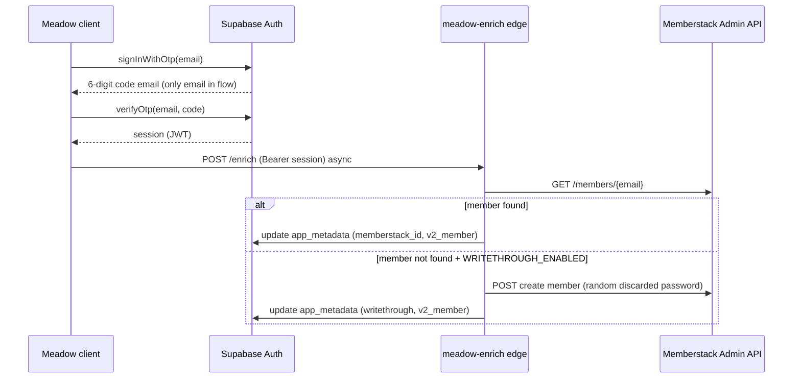

# Meadow Backend Ask — Identity (Supabase OTP + Memberstack enrichment)

**Status:** PENDING APPROVAL  
**Supersedes:** `docs/MEADOW_BACKEND_ASK_P2.md` (Memberstack password bridge — **SUPERSEDED**)  
**Hosting:** Experience at `https://booster.storytailor.com`; assets at `https://assets.storytailor.dev/meadow/` (see `docs/MEADOW_DEPLOYMENT.md`).  
**Authority:** `docs/MEADOW_IDENTITY_PRD.md`  
**Green backend:** OFF-LIMITS until `STORYTAILOR_ALLOW_BACKEND_CHANGE` is set by a human for the implementing commit.

---

## Summary

Ship **Supabase Auth email OTP** as the only Meadow sign-in method. Memberstack is **never** in the auth path. After every successful OTP verification, a **non-blocking server job** enriches the Supabase user from Memberstack Admin API and optionally **write-through** creates a Memberstack member for net-new Meadow signups.

The meadow frontend (`experiences/false-earth`) calls either:

- Supabase client `signInWithOtp` / `verifyOtp` directly (when `VITE_SUPABASE_URL` + `VITE_SUPABASE_ANON_KEY` are set), or
- A thin edge proxy at `VITE_MEADOW_AUTH_URL` (preferred for CORS/rate-limit control)

Until deployed, the UI uses local mock via `?meadow-auth-mock=1`.

---

## Architecture



---

## Edge functions (Supabase project `lendybmmnlqelrhkhdyc`)

### `meadow-auth` (optional OTP proxy)

Thin proxy if direct client OTP is undesirable (rate limits, origin lockdown).

| Env var | Default | Behavior |
|---------|---------|----------|
| `MEADOW_AUTH_ENABLED` | `false` | When not `true`, return `503` `{ "message": "Account connection isn't ready yet" }` |

**Actions**

| Action | Request | Response |
|--------|---------|----------|
| `sendOtp` | `{ "action": "sendOtp", "email": "..." }` | `200` `{ "ok": true }` |
| `verifyOtp` | `{ "action": "verifyOtp", "email": "...", "code": "123456" }` | `200` `{ "session": { "userId", "email" } }` |
| `signOut` | `{ "action": "signOut" }` | `200` (clear cookie if cookie mode) |
| `getSession` | `GET ?action=getSession` | `{ "session": ... \| null }` |

Internally calls Supabase Auth Admin or anon client with service role for OTP dispatch. **Never** expose service role to meadow bundle.

**CORS:** `https://booster.storytailor.com`, `https://localhost:5173`, staging meadow host.

### `meadow-enrich` (post-auth job)

Fires after every successful OTP verification (client fire-and-forget or Supabase Auth hook).

| Env var | Default | Behavior |
|---------|---------|----------|
| `ENRICHMENT_ENABLED` | `true` | When `false`, skip Memberstack GET; auth unaffected |
| `WRITETHROUGH_ENABLED` | `true` | When `false`, skip Memberstack create for new users |

**Flow**

1. Validate Supabase JWT from `Authorization: Bearer`.
2. If `ENRICHMENT_ENABLED !== true` → `200` no-op.
3. `GET https://admin.memberstack.com/members/{email}` (Memberstack secret, server only).
4. **Found:** update `auth.users` `app_metadata`:
   - `memberstack_id`
   - `origin: "meadow"`
   - `v2_member: true`
   - `enriched_at` (ISO timestamp)
   - `writethrough: false`
5. **Not found** and `WRITETHROUGH_ENABLED === true`:
   - `POST` create Memberstack member with **random cryptographically strong password** (generated, used once, **never stored or logged**)
   - `metaData.source: "meadow"`
   - Update `app_metadata`: `memberstack_id`, `v2_member: false`, `writethrough: true`, `enriched_at`
6. Failures: log + retry with backoff (queue or cron). **Never** return errors to client; session already issued.

### `meadow-memberstack-webhook`

| Event | Handler |
|-------|---------|
| `member.updated` | Resync email + plan snapshot to Supabase user matched by `memberstack_id` |
| `member.deleted` | Unlink `memberstack_id`, set `v2_member: false`, revoke Hue tokens |

**Security:** Verify Memberstack webhook signature (Node Admin Package). Idempotent on event id.

---

## `auth.users.app_metadata` fields

| Field | Type | Notes |
|-------|------|-------|
| `memberstack_id` | `string` nullable | Set by enrichment or write-through |
| `origin` | `"meadow"` | Immutable source tag for V3 comms segmentation |
| `v2_member` | `boolean` | `true` if Memberstack member existed at first enrich |
| `enriched_at` | `string` (ISO) | Last successful enrichment timestamp |
| `writethrough` | `boolean` | `true` if Memberstack member was created by Meadow |

`profiles` table: unchanged from main Meadow PRD.

---

## Secrets (server only)

| Secret | Store | Never |
|--------|-------|-------|
| Memberstack Admin secret key | Supabase Vault / AWS SSM | Client bundle, repo, logs |
| Supabase service role key | Supabase Vault / AWS SSM | Client bundle, repo, logs |
| Memberstack webhook signing secret | Supabase Vault / AWS SSM | Client bundle, repo, logs |

---

## One-email guarantee (regression gate)

| Flow | Supabase emails | Memberstack emails | Total |
|------|-----------------|-------------------|-------|
| Email-code sign-in | 1 (code) | 0 | **1** |
| Write-through create | 0 | 0 | **0** |
| Hue connect | 0 | 0 | **0** |

Any PR that increases a cell above these limits **fails review**.

---

## Day-one sandbox verification (write-through)

Before `WRITETHROUGH_ENABLED=true` in production:

1. Memberstack sandbox: create member via Admin REST with random password.
2. Complete passwordless-code login as that member at V2.
3. **Pass** → enable write-through in prod.
4. **Fail** → set `WRITETHROUGH_ENABLED=false`, file Memberstack support ticket; auth still ships.

---

## Frontend contract (implemented in meadow fork)

| File | Role |
|------|------|
| `src/api/meadowAuthApi.ts` | `sendOtp`, `verifyOtp`, `signOut`, `getSession` → `VITE_MEADOW_AUTH_URL` or mock |
| `src/config/meadow.ts` | `VITE_SUPABASE_URL`, `VITE_SUPABASE_ANON_KEY` placeholders for future direct OTP |
| `src/ui/AuthSheet.tsx` | PRD §4 OTP UI (email → code, no OAuth/password) |
| `src/core/store/meadowAuthStore.ts` | Session + Hue intent resume |

**Env**

```bash
# Edge proxy (optional — preferred for rate limiting)
VITE_MEADOW_AUTH_URL=https://<project-ref>.supabase.co/functions/v1/meadow-auth

# Direct Supabase OTP (future — anon key only, never service role)
VITE_SUPABASE_URL=https://<project-ref>.supabase.co
VITE_SUPABASE_ANON_KEY=<anon-key>
```

**Local mock:** `?meadow-auth-mock=1` on meadow URL.

---

## Superseded: P2 password bridge

`docs/MEADOW_BACKEND_ASK_P2.md` described a **Memberstack password** sign-in/sign-up bridge. That design is **retired**:

- Password fields removed from Meadow UI
- Memberstack credentials never collected client-side
- Auth path is Supabase OTP only; Memberstack is enrichment + optional write-through

---

## Out of scope

- Google / Apple OAuth at Meadow (V3 launch)
- Path A full JWT issuance to meadow for story APIs
- Org / StorytailorID / Care Circle flows
- Hue OAuth implementation (P3 — separate backend ask)

---

## Approval checklist

- [ ] Product approves `docs/MEADOW_IDENTITY_PRD.md` architecture
- [ ] Memberstack Admin secret + webhook secret provisioned (server only)
- [ ] Supabase OTP email template branded (hello@ or booster@ — open question §8.2)
- [ ] Day-one sandbox write-through test passed
- [ ] `MEADOW_AUTH_ENABLED=true` only after staging curl + inbox proof (AC1)
- [ ] Human sets `STORYTAILOR_ALLOW_BACKEND_CHANGE` for implementing commit

---

## Verification (post-implementation)

```bash
# Kill switch off
curl -s -o /dev/null -w "%{http_code}" -X POST "$MEADOW_AUTH_URL" \
  -H 'Content-Type: application/json' \
  -d '{"action":"sendOtp","email":"test@example.com"}'
# Expect 503

# Staging send OTP (enabled)
curl -s -X POST "$MEADOW_AUTH_URL" \
  -H 'Content-Type: application/json' \
  -d '{"action":"sendOtp","email":"meadow-test@storytailor.dev"}'
# Expect 200; exactly 1 email in inbox

# Verify OTP
curl -s -X POST "$MEADOW_AUTH_URL" \
  -H 'Content-Type: application/json' \
  -c cookies.txt \
  -d '{"action":"verifyOtp","email":"meadow-test@storytailor.dev","code":"123456"}'
# Expect session JSON

# Enrichment (async — check app_metadata within 60s)
# memberstack_id present for existing V2 member; writethrough tag for new user
```

Frontend: `npm run dev` → START → lamp icon → auth sheet → `?meadow-auth-mock=1` → enter email → code `000000` → Hue sheet opens if intent set.
