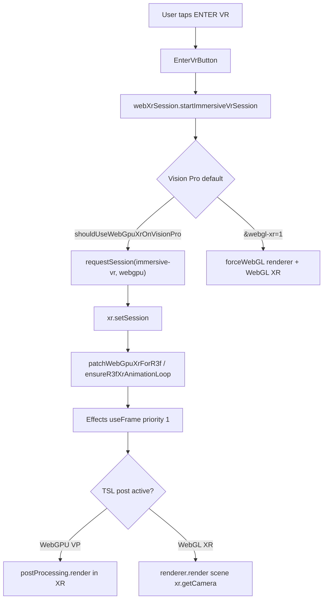

# Vision Pro WebXR Audit — Booster's Meadow

**Date:** 2026-07-15  
**Scope:** Audit only — no VR behavior changes in this document.  
**Target:** `booster.storytailor.com?webxr=1` on Apple Vision Pro (Safari, visionOS).  
**Recent deploys reviewed:** `cea9619`, `d97bf40`, `377827a`, `28481a6`, `08e262c`.

---

## Executive summary

Vision Pro ENTER VR fails or ends within seconds because the meadow stacks **three.js r185 WebGPURenderer + WebGPU XR session feature + React Three Fiber XR animation-loop wiring + TSL post-processing** on a **still-maturing WebKit WebGPU/WebXR compositor**. Recent commits improved symptoms (render-loop shim, scissor patches, WebGL fallback path) but the **default flat path** (`?webxr=1` without `&webgl-xr=1`) still requests **`immersive-vr` with optional `webgpu`** and runs the full WebGPU compute-grass scene through custom XR frame rendering in `Effects.tsx`.

The **official** long-term fix is not more scissor hacks — it is aligning with **three.js XRManager + WebGPURenderer WebXR** as documented in r185, ensuring **R3F's `xr.setAnimationLoop` contract** is satisfied without private `_currentAnimationLoop` mutation, and validating against **Apple's WebXR guidance** (WWDC24 session + WebKit feature flags) on device.

---

## Symptom catalog (production)

| Symptom | User-facing copy | Likely layer |
|--------|------------------|--------------|
| Button never appears | (no ENTER VR) | `probeVrPreview` / feature flags / not on headset |
| "Meadow is still loading" | `RENDERER_NOT_READY_BODY` | `getVrRenderer()` null before `renderer.init()` |
| Session starts then black / immediate exit | `VR_ENDED_UNEXPECTEDLY_BODY` | Render loop, wrong camera, scissor, or post path |
| Timeout | Generic device body | `requestSession` 45s cap on visionOS |
| WebGPU session feature rejected | Generic device body | Browser lacks stable `webgpu` XR binding |

---

## Architecture (as shipped)

**Key files**

| File | Role |
|------|------|
| `src/ui/EnterVrButton.tsx` | UI gate; requires `isControlEnabled` + `probeVrPreview` |
| `src/core/xr/webXrSession.ts` | Session request, `webgpu` feature on VP, error sanitization |
| `src/core/xr/patchWebGpuXrForR3f.ts` | **Shim** — adds `setAnimationLoop` to r185 WebGPU XRManager |
| `src/core/xr/patchXrRenderCamera.ts` | Redirect `renderer.render` to `xr.getCamera()` while presenting |
| `src/core/xr/patchVisionOsWebGpuXrScissor.ts` | **Workaround** — no `setScissorRect` while presenting |
| `src/core/xr/patchVisionOsWebGlXrScissor.ts` | Same for WebGL scissor on `&webgl-xr=1` |
| `src/config/vrProfile.ts` | VP defaults WebGPU XR; Quest forces WebGL backend |
| `src/app/App.tsx` | Renderer init, VR patches gated on `?webxr=1` |
| `src/components/Effects/Effects.tsx` | **Owns XR render** at `useFrame(..., 1)` |
| `src/components/xr/VrSessionBridge.tsx` | Locomotion; clears scene background on WebGL XR |

---

## Root-cause hypotheses (ranked by confidence)

### 1. R3F ↔ three.js WebGPU XR animation-loop gap — **HIGH**

**Evidence**

- `patchWebGpuXrForR3f.ts` documents that **three.js r185 WebGPU `XRManager` lacks public `setAnimationLoop`**, while `@react-three/fiber` wires XR via `xr.setAnimationLoop(handleXRFrame)` on `sessionstart`.
- Without the shim, `_currentAnimationLoop` stays the flat `requestAnimationFrame` loop **without an `XRFrame`**, and `Effects` `useFrame` at priority 1 is responsible for XR rendering — if the loop never receives `frame`, output is black.
- `ensureR3fXrAnimationLoop` is called after `setSession` — timing-sensitive.

**Official fix direction**

- Upgrade to a three.js build where **WebGPURenderer XRManager exposes the same animation-loop API as WebGL XRManager**, or use R3F's documented WebXR entry (`@react-three/xr` / Canvas `gl` XR flags) once WebGPU XR is first-class.
- Remove private `_currentAnimationLoop` writes; use **renderer.setAnimationLoop** per [WebGPURenderer manual](https://threejs.org/manual/en/webgpurenderer.html).

**References**

- [three.js PR #30346 — WebGPURenderer XRManager](https://github.com/mrdoob/three.js/pull/30346)
- [three.js r185 — Add support for WebXR with WebGPU (#33583)](https://github.com/mrdoob/three.js/releases/tag/r185)
- Meadow: `src/core/xr/patchWebGpuXrForR3f.ts`

---

### 2. WebGPU XR + TSL PostProcessing on visionOS — **HIGH**

**Evidence**

- On Vision Pro default path, `shouldForceWebGlRendererBackend()` is **false**, so `Effects` builds a full **TSL `PostProcessing`** graph (bloom, DOF, meadow grade, film grain).
- XR branch calls `postProcessingRef.current.render()` when presenting and not on WebGL backend (`Effects.tsx` ~247–253).
- WebGPU XR compositor on Safari is newer than WebGL XR; post chains that assume flat swapchain dimensions may fail silently or end the session.

**Official fix direction**

- Per three.js docs, call **`xr.renderLayers()`** where required before scene render in XR workflows ([XRManager](https://threejs.org/docs/pages/XRManager.html)).
- For MVP VP proof: **immersive scene render without TSL post** (tone mapping only), then re-enable post once validated — not as permanent WebGL fallback, but as staged WebGPU XR bring-up.
- Validate with minimal three.js `webgpu_xr` example on device before reintroducing meadow grade.

**References**

- [XRManager.renderLayers()](https://threejs.org/docs/pages/XRManager.html)
- Meadow: `src/components/Effects/Effects.tsx`

---

### 3. WebKit scissor / compositor contract (bug 315274) — **MEDIUM–HIGH**

**Evidence**

- `patchVisionOsWebGpuXrScissor.ts` cites WebKit [bug 315274](https://bugs.webkit.org/show_bug.cgi?id=315274): **any** `GPURenderPassEncoder.setScissorRect` during immersive WebGPU XR can clip to black on visionOS.
- PlayCanvas engine [#8756](https://github.com/playcanvas/engine/issues/8756) reported the same class of failure on AVP.
- Patch no-ops scissor while `renderer.xr.isPresenting` — reduces symptom but does not fix upstream callers that may set scissor through other paths.

**Official fix direction**

- WebKit fix on their side; track bug 315274.
- Engine-side: honor **Compositor Contract** (three.js r185 changelog item) and avoid scissor during XR on visionOS until WebKit confirms fixed.

---

### 4. `webgpu` session feature availability / adapter mismatch — **MEDIUM**

**Evidence**

- `webXrSession.ts` requests `{ optionalFeatures: ['local-floor', 'webgpu'] }` on VP when `shouldUseWebGpuXrOnVisionPro()`.
- three.js [PR #33497](https://github.com/mrdoob/three.js/pull/33497) discusses **WebGPU page + WebGL XR fallback** when session lacks `webgpu` feature — meadow partially implements this via `forceWebGL` but VP default avoids it.
- If Safari grants session **without** `webgpu` but renderer stays on WebGPU backend, `setSession` / bind may fail or present black.

**Official fix direction**

- After `requestSession`, inspect `session.enabledFeatures` (or equivalent) and **require WebGPU XR binding only when feature granted**; otherwise follow three.js documented fallback path explicitly (not ad-hoc scissor hacks).
- Long term: `GPUAdapter.features` / standardized WebGPU+XR capability probe (discussed in three.js PR #33497).

---

### 5. Flat-camera render after XR bind — **MEDIUM**

**Evidence**

- `patchXrRenderCamera.ts` patches `renderer.render` to swap in `xr.getCamera()` while presenting — needed because R3F calls `gl.render(scene, state.camera)` after `useFrame`.
- If patch order fails or a code path bypasses patched `render`, Vision Pro shows black or corrupt swapchain.

**Official fix direction**

- Use R3F XR mode where framework passes XR array camera consistently, or render via `XRManager` APIs only during presentation.

---

### 6. MSAA / samples on XR layer — **LOW–MEDIUM**

**Evidence**

- `App.tsx` sets `samples: 0` and `antialias: false` when `forceWebGlForXr && isVisionOsBrowser()` — PlayCanvas AVP guidance.
- **Default VP WebGPU path** may still use MSAA defaults incompatible with immersive layer.

**Official fix direction**

- Align WebGPU XR layer creation with Apple / PlayCanvas AVP guidance (no MSAA on immersive layer).

---

### 7. Operational / gating — **LOW**

**Evidence**

- ENTER VR hidden until `isControlEnabled` (camera reset after START) — users who tap too early see "still loading".
- `?webxr=1` required; WebXR Device API must be enabled in Safari Advanced → Feature Flags on device ([WebKit blog](https://webkit.org/blog/15162/introducing-natural-input-for-webxr-in-apple-vision-pro/)).

---

## What "official fix" looks like (no permanent hacks)

1. **Capability probe at boot (once)**  
   - `navigator.xr.isSessionSupported('immersive-vr')`  
   - Request test session or use feature detection for `webgpu` XR  
   - Choose renderer backend per three.js r185 WebGPU XR support matrix  

2. **Renderer / loop**  
   - `await renderer.init()` before ENTER VR  
   - `await renderer.xr.setSession(session)`  
   - Single animation loop via **public** `renderer.setAnimationLoop` / XRManager API  
   - Delete `_currentAnimationLoop` shim when three.js + R3F versions align  

3. **Frame graph**  
   - XR: `xr.renderLayers()` if required → `renderer.render(scene, xr.getCamera())`  
   - Minimal shader graph first; add TSL post only after immersive green  

4. **visionOS validation**  
   - Safari Feature Flags: WebXR Device API ON  
   - Test on **physical Vision Pro** (Vercel preview SSO blocks headset testing)  
   - File WebKit bugs at [bugs.webkit.org](https://bugs.webkit.org/) with repro URL `booster.storytailor.com?webxr=1&debug=1`  

5. **Do not treat as permanent**  
   - `patchVisionOsWebGpuXrScissor` / `patchVisionOsWebGlXrScissor`  
   - `&webgl-xr=1` degraded path (emergency only)  
   - Private field mutation in `patchWebGpuXrForR3f`  

---

## Blockers outside meadow code

| Blocker | Owner | Notes |
|---------|-------|-------|
| WebKit WebGPU XR compositor + scissor | Apple WebKit | [315274](https://bugs.webkit.org/show_bug.cgi?id=315274) |
| WebGPU XR feature stability on visionOS | Apple / W3C WebGPU WG | Session feature optional today |
| three.js WebGPU XRManager API parity with WebGL | three.js | r185 added support; R3F integration still catching up |
| R3F WebGPU XR first-class docs | pmndrs | Today meadow patches at integration boundary |
| Vercel preview SSO | Storytailor ops | Headset testing must use production domain |

---

## Apple / three.js source links

| Source | URL |
|--------|-----|
| WWDC24 — Build immersive web experiences with WebXR | https://developer.apple.com/videos/play/wwdc2024/10066/ |
| WebKit — Natural input for WebXR on Vision Pro | https://webkit.org/blog/15162/introducing-natural-input-for-webxr-in-apple-vision-pro/ |
| three.js r185 release (WebXR + WebGPU) | https://github.com/mrdoob/three.js/releases/tag/r185 |
| three.js XRManager docs | https://threejs.org/docs/pages/XRManager.html |
| three.js WebGPURenderer manual | https://threejs.org/manual/en/webgpurenderer.html |
| three.js PR — WebGPU XR fallback (#33497) | https://github.com/mrdoob/three.js/pull/33497 |
| WebKit bug — scissor / XR | https://bugs.webkit.org/show_bug.cgi?id=315274 |

---

## Recommended next engineering steps (when VR code changes are allowed)

1. **Minimal XR sandbox** — fork `webgpu_xr` official example inside meadow repo; prove green on VP without grass/roses/post.  
2. **Instrument** — keep `vrSessionDebug` logging; add `session.enabledFeatures` + `renderer.xr.isPresenting` + frame count to weekly VP smoke.  
3. **Stage post** — immersive render untoned scene first; enable meadow grade in XR only after baseline green.  
4. **Version bump** — track three.js + `@react-three/fiber` releases for public WebGPU `setAnimationLoop`; remove shim.  
5. **WebKit** — attach reproducible minimal case to bug 315274 if scissor patch still required on latest visionOS beta.

---

## Commits reviewed (context)

| Commit | Intent | VP impact |
|--------|--------|-----------|
| `08e262c` | Flat `?webxr=1` preview before ENTER | Desktop emulation only |
| `28481a6` | WebGL XR grass/terrain parity | `&webgl-xr=1` path only |
| `377827a` | Restore VP immersive render loop | Shim `ensureR3fXrAnimationLoop` |
| `d97bf40` | VP default WebGPU compute grass | Keeps heavy WebGPU path in XR |
| `cea9619` | Gate ENTER VR to Quest + VP | Reduces noise, not root cause |

---

*This document is audit-only. Implementation changes require a separate VR fix pass and flat-meadow regression check (`booster.storytailor.com` without `?webxr=1`).*
