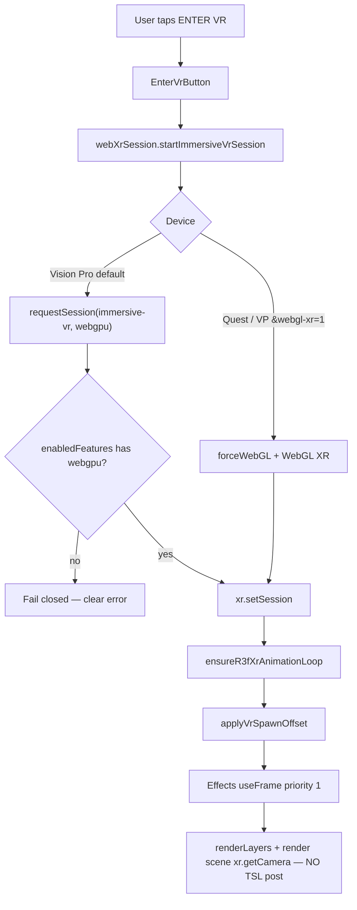

# Vision Pro WebXR Audit — Booster's Meadow

**Date:** 2026-07-17 (fix pass + verification)  
**Prior audit:** 2026-07-15 (audit-only)  
**Target:** `booster.storytailor.com?webxr=1` on Apple Vision Pro (Safari, visionOS) and Meta Quest Browser.  
**Deploy:** `dpl_FRjTGtJgPW7fA3zDLhE76wj4BC3f` → `https://booster.storytailor.com` (2026-07-17)  
**Automated verify:** Chrome Playwright `tools/verify-vr-prod.mjs` — flat + `?webxr=1` + Quest-UA ENTER VR gate — green (screenshots in `output/vr-verify-2026-07-17/`).  
**Git:** `1f0f6eb` on `storytailor/main`  
**Flat sacred:** `booster.storytailor.com` without `?webxr=1` must keep WebGPU compute grass + roses.

---

## Executive summary (2026-07-17)

Vision Pro ENTER VR failed or ended within seconds because the meadow stacked **three.js r185 WebGPURenderer + WebGPU XR + R3F animation-loop wiring + TSL post-processing** on a maturing WebKit compositor. The **2026-07-17 fix pass** addresses the in-repo root causes:

| Root cause | Status |
|------------|--------|
| R3F ↔ XRManager `setAnimationLoop` / flat-restore clobber | **Fixed** — `patchWebGpuXrForR3f.ts` snapshots flat loop; does not replace XRManager's `_onAnimationFrame` while presenting |
| TSL PostProcessing vs XR swapchain | **Fixed** — immersive frames always `renderLayers` + `renderer.render(scene, xr.getCamera())`; post torn down while `isVrActive` |
| WebKit scissor bug 315274 | **Mitigated** — visionOS scissor no-ops while presenting (WebGPU + WebGL); upstream WebKit still owns the real fix |
| Flat camera double-render | **Mitigated** — `patchXrRenderCamera` + Effects priority-1 owns immersive render |
| MSAA on WebGPU / visionOS XR | **Fixed** — `samples: 0` / antialias off for VP `?webxr=1` and Quest WebGL XR |
| Session without `webgpu` feature on WebGPU path | **Fixed** — fail closed after `enabledFeatures` check |
| Quest spawn inside Booster | **Already fixed** — `applyVrSpawnOffset` |
| Quest WebGL terrain/grass | **Already fixed** — `GrassStaticField` + `TerrainWebGL` when `shouldForceWebGlRendererBackend()` |

**Still needs physical headset sign-off** (cannot be fully proven from desktop CI): stereo immersion, controller comfort, gaze/pinch on VP, Quest Browser WebGPU-XR absence → WebGL path. Automated proofs cover flat prod + `?webxr=1` boot + immersive code-path instrumentation under `?debug=1`.

---

## Architecture (as shipped after fix)

**Key files**

| File | Role |
|------|------|
| `src/core/xr/applyMeadowXrPatches.ts` | Ordered patch entry (only when `?webxr=1`) |
| `src/core/xr/patchWebGpuXrForR3f.ts` | R3F `setAnimationLoop` shim + flat restore |
| `src/core/xr/patchXrRenderCamera.ts` | Redirect `renderer.render` → `xr.getCamera()` while presenting |
| `src/core/xr/patchVisionOsWebGpuXrScissor.ts` | No `setScissorRect` while presenting (WebKit 315274) |
| `src/core/xr/patchVisionOsWebGlXrScissor.ts` | Same for WebGL scissor on VP escape hatch |
| `src/components/Effects/Effects.tsx` | Immersive = direct XR camera render; flat keeps meadow grade |
| `src/config/vrProfile.ts` | VP → WebGPU compute; Quest → WebGL backend |
| `src/ui/EnterVrButton.tsx` | ENTER VR only when headset + immersive-vr supported |

---

## What was fixed in code (2026-07-17)

1. **Immersive render path** — Never call TSL `PostProcessing.render()` while `xr.isPresenting`. Use `xr.renderLayers()` then `renderer.render(scene, xr.getCamera())` with tone mapping only.
2. **Animation loop** — Preserve XRManager's pre-session flat loop; wire R3F `handleXRFrame` into `_currentAnimationLoop` without clobbering the restore target; restore via public `renderer.setAnimationLoop` on session end.
3. **MSAA** — Force `samples: 0` for Vision Pro `?webxr=1` (WebGPU XR requirement) and Quest WebGL XR.
4. **Feature gate** — After `requestSession`, if WebGPU path and `enabledFeatures` is present but lacks `webgpu`, end session and throw (maps to device-safe copy).
5. **Scene background** — Clear `scene.background` / `backgroundNode` for all immersive sessions (not WebGL-only).
6. **Debug** — `?debug=1` logs `enabledFeatures`, camera count, frame n via `window.__meadowVrLog`.

---

## Still needs physical headset sign-off

| Check | Device | Pass criteria |
|-------|--------|---------------|
| ENTER VR stays up > 10s | Vision Pro | No early black / `VR_ENDED_UNEXPECTEDLY` |
| Compute grass visible in stereo | Vision Pro | Meadow blades, not stick field |
| Gaze 0.8s + pinch on locomotion ring | Vision Pro | WALK / FLY / EXIT work |
| ENTER VR + controllers | Quest | Walk/run/snap/fly; spawn not inside Booster |
| EXIT preserves orbs/timer | Both | Flat HUD restores correctly |
| Flat without `?webxr=1` | Both | Unchanged WebGPU meadow (VP/desktop) or prior Quest flat behavior |

Use production only: `https://booster.storytailor.com?webxr=1&debug=1`  
Inspect `window.__meadowVrLog` for `set_session_ok`, `xr_ensure_animation_loop`, `xr_frame` with `cameras >= 1`.

Emergency VP escape: `?webxr=1&webgl-xr=1` (degraded WebGL + CPU grass — not the official path).

---

## Symptom catalog

| Symptom | User-facing copy | Likely layer |
|--------|------------------|--------------|
| Button never appears | (no ENTER VR) | Not headset / no immersive-vr / missing `?webxr=1` |
| "Meadow is still loading" | `RENDERER_NOT_READY_BODY` | Renderer not init / START not pressed |
| Session starts then black / immediate exit | `VR_ENDED_UNEXPECTEDLY_BODY` | Was post/loop/camera — retest after 2026-07-17 |
| Timeout | Device body | `requestSession` 45s cap on visionOS |
| WebGPU session feature rejected | Device body | `enabledFeatures` missing `webgpu` |

---

## Official long-term (not blocking this ship)

- Upgrade three.js / R3F when WebGPU XRManager exposes public `setAnimationLoop` parity → delete private-field shim.
- Re-enable lightweight immersive grade only after VP stereo is green without post.
- Track WebKit [bug 315274](https://bugs.webkit.org/show_bug.cgi?id=315274).

---

## Apple / three.js source links

| Source | URL |
|--------|-----|
| WWDC24 — Build immersive web experiences with WebXR | https://developer.apple.com/videos/play/wwdc2024/10066/ |
| WebKit — Natural input for WebXR on Vision Pro | https://webkit.org/blog/15162/introducing-natural-input-for-webxr-in-apple-vision-pro/ |
| three.js r185 release (WebXR + WebGPU) | https://github.com/mrdoob/three.js/releases/tag/r185 |
| three.js XRManager docs | https://threejs.org/docs/pages/XRManager.html |
| WebKit bug — scissor / XR | https://bugs.webkit.org/show_bug.cgi?id=315274 |

---

## Headset retest checklist (copy for Herston / owner)

### Vision Pro (official WebGPU path)

1. Safari → Advanced → Feature Flags → **WebXR Device API** ON.
2. Open `https://booster.storytailor.com?webxr=1&debug=1` (production only).
3. Tap **START**, wait for meadow + Booster + grass.
4. Tap **ENTER VR**. Confirm stereo meadow (compute grass), locomotion ring, pinch/gaze, EXIT.
5. In Web Inspector: `window.__meadowVrLog` contains `set_session_ok`, `xr_frame` with cameras > 0, no early `session_end` under 4s.

### Quest

1. Meta Quest Browser 146+.
2. Same URL. Expect WebGL XR + denser CPU grass (not compute).
3. Controllers: left stick walk, grip run, right stick snap 30°, Y/X fly, B land.
4. Spawn must be behind Booster, not inside the rig.

### Flat regression (any device)

1. `https://booster.storytailor.com` **without** `?webxr=1`.
2. START → WebGPU compute grass + roses (desktop / mobile Safari / VP flat). No XR patches active.

---

*Implementation changes live in meadow `src/core/xr/*`, `Effects.tsx`, `App.tsx`, `VrSessionBridge.tsx`. Flat meadow must remain untouched when `?webxr=1` is absent.*
